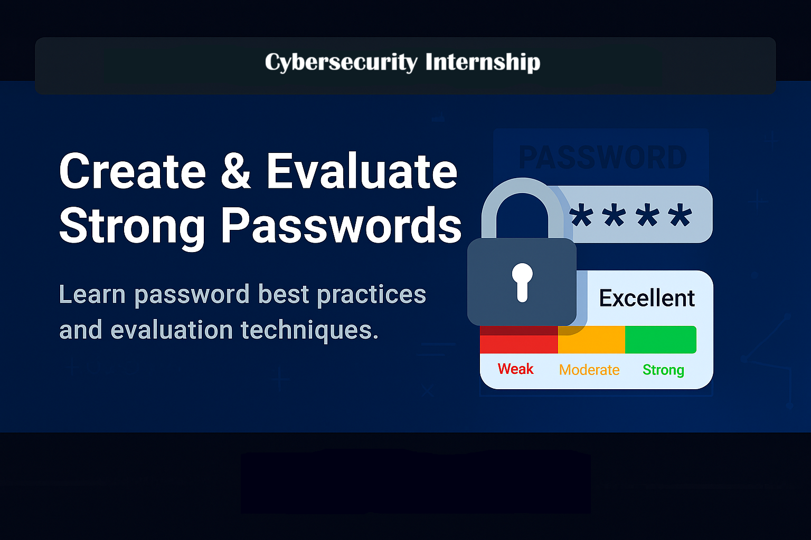

# 🔐 Cybersecurity Internship

# **Create & Evaluate Strong Passwords**

  

### *Learn password best practices and evaluation techniques.*

## 📋 Project Overview
This project analyzes password strength by testing various passwords against online strength checkers and evaluating security best practices.

## 🎯 Objectives
- Understand what makes a password strong
- Test passwords against strength evaluation tools  
- Learn about common password attacks
- Document password security best practices

## 📊 Password Strength Analysis
We tested passwords across the strength spectrum:

| Strength Level | Example | Score | Characteristics |
|----------------|---------|-------|-----------------|
| **Weak** | `password123` | 1% | Common words, sequential numbers |
| **Moderate** | `Summer2024!` | 65% | Mixed case, but predictable patterns |
| **Strong** | `C0mpl3x!ty@Sec` | 100% | Complex character mix, good length |

## 🛠️ Tools Used
- [Password Meter](http://www.passwordmeter.com)
- Various online password strength checkers

## 🚀 Quick Start
1. Review the full report in `/report/Password-Strength-Analysis-Report.md`
2. Check the password samples in `/passwords/password-samples.md`
3. Run the password generator: `python scripts/password-generator.py`

---

**From Weak to Strong: Mastering Password Security**

